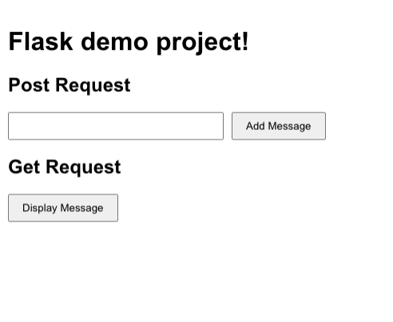

# FlaskAPIDemoProject

Implemented POST and GET requests using Flask API as backend and React as Frontend.

    -- Users can add the message and retrieve the message that they have added previously.

Backend(Flask API):

    -- To run this backend endpoint have to set up the environment.
    -- To create : python3 -m venv env.
    -- Activate: source env/bin/activate.

Run this below command:

    -- "pip install flask" is used to make HTTP requests.
    -- "pip install flask_cors": It helps connect both the backend and front end.
    -- Finally, need to start the development server in the backend.

To run the project:

    -- In the base directory run: "npm install" before running the scripts below.
    -- Then, run "python app.py" to start the flask backend server in one terminal.
    -- Open http://localhost:5000 to view it in the browser.
    -- Next, open another terminal for the frontend directory and run "npm start" to start the frontend of the application.
    -- Open http://localhost:3000 to view it in the browser.

Testing the application:

Enter a text or message and click on the "Add Message" button to initiate POST request, then click the "Display Message" button to view the message.

